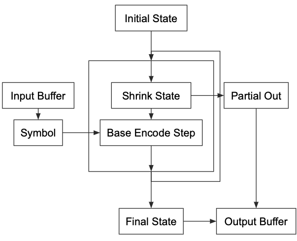

# EE274 Final Report
Ian MacFarlane - ianpmac (at) stanford (dot) edu

## Hardware Implementations of Huffman/rANS coders.

While we often talk about compression algorithms in the software domain (or at least we have in EE274), in practice many compression schemes are implemented in hardware due to the ubiquity of data compression and the corresponding performance gains of hardware. Examples of common compression schemes implemented in hardware are Huffman codes, HEIC, JPEG, AV1, and LZ77/LZW (as well as tons more). This project aims to similarly practice implementing data compression in hardware. Specifically, I am implementing a Huffman coder and an rANS coder in hardware. Due to the mountain of existing implementations for these schemes and their many variants, I am not expecting these implemementations to be particularly novel, but I do expect they will be good practice and can also serve to illustrate the tradeoffs of implementing in the hardware domain vs. the software domain.

Note for viewers who previously read the project milestone: a fair amount of this content is repurposed from the milestone, though I've added several sections and filled out the results a bit.

### Literature and Reference Implementations

Full references are linked and listed at the bottom. The first few references are materials related to Huffman coders and the last few correspond to rANS.

I'll further note that since Huffman coding has been around for a while, many papers discussing straightforward implementations are fairly old (as is the case for the first two papers). This first paper discusses a finite-state machine implementation of Huffman decoders, which relies on the prefix-free property of Huffman codes to decode encoded symbols via state evolution. The prefix-free property makes this possible by guaranteeing that the state machine will not interpret a symbol stop erroneously even if it parses the bitstream one bit at a time. While not a very throughput-efficient implementation, it is quite space-efficient, and I ended up using it for the Huffman decoder to keep it interesting.

[An efficient finite-state machine implementation of Huffman decoders](#1)

This next paper is a similar space-efficiency optimization technique for Huffman decoders, and though I didn't end up using it, the paper is interesting to read.

[Design and hardware implementation of a memory efficient Huffman decoding](#2)

Finally, this last Huffman-related paper is a bit overspecific to a certain implementation of a real-time Huffman coder, but it has some useful discussion related to the serialization of the variable-length Huffman encoded symbols into a fixed-size buffer.

[Design and implementation of static Huffman encoding hardware using a parallel shifting algorithm](#3)

After the huge amount of existing resources on hardware Huffman coders, I was a little surprised to see rANS discussion mainly kept in the software domain. I'm still looking for materials here, so additional suggestions are welcome!

[An FPGA-Based LOCO-ANS Implementation for Lossless and Near-Lossless Image Compression Using High-Level Synthesis](#4)

I also later found this really cool paper which discusses how to do effective Huffman decoder parallelization on GPUs (which similarly applies to hardware.

[Massively Parallel Huffman Decoding on GPUs](#5)

Here's a few more papers I've looked at that go through software implementations but that have some application to hardware:


And a blog post I found quite useful in enumerating rANS optimizations:

[rANS with static probability distributions](https://fgiesen.wordpress.com/2014/02/18/rans-with-static-probability-distributions/)

## Methods and Implementation

For this project, I am implementing both a static (though generally reprogrammable) Huffman coder -- mostly as a "warmup" of sorts -- and an rANS coder in SystemVerilog. Click [here](verilog) if you want to see the implementation code directly.

### Huffman Coder

The Huffman implementation is fairly simple, but still worth explaining, as it illustrates some of the concerns in hardware design. 

#### Encoder-side
Encoding for a Huffman coder is straightforward, but it's first worth defining our inputs/outputs/etc. so that we can reason about how our module stands alone or fits into other hardware. For input, we assume we have access to a stream of symbols, perhaps given in parallel cycle-by-cycle. Ideally, we want to be able to feed new symbols in every clock cycle, so our module should work (pipelined or otherwise) to have a throughput equal to our input. Lastly, we want to output a serialized set of symbols such that we can easily read out the encoding data. 

Now that we've defined how this module integrates with its surroundings we can discuss the internals. As mentioned previously we assume that we have access to an externally-supplied stream of symbols, then we split these symbols many ways and encode them in parallel via lookup table. Doing this in hardware allows for a very high degree of parallelization (though SIMD instructions manage similarly). Lastly, the main important concern for the encoding side is re-serializing the data for storage/communication and eventual decoding. In this code, parallelized encoding is done in the [huff_encoder_atom](verilog/huff_encoder_atom.sv) blocks, which are managed by the more general [huff_encoder](verilog/huff_encoder.sv) block, which coordinates the atoms and manages data flow. I also define a [symbol_lut](verilog/symbol_lut.sv), which is really just a plug-and-play memory block that we use across all the implementations.

#### Decoder-side
Next is decoding for the Huffman coder. While there are many ways of implementing a Huffman decoder (one straightforward option would be to use a lookup table similar to the encoder), I was drawn to an old [solution](#1) that used a finite state machine to do the decoding, using the prefix-free property of Huffman codes to read the bitstream bit-by-bit and parse out symbols via state evolution. It's worth noting that this isn't a particularly throughput-optimized implementation (in contrast to the encoder). Instead, this implementation is designed more for logical simplicity / space efficiency. I chose it instead of a repeat of the LUT-based solution to illustrate (and practice) the range of solutions in this space.

In more concrete terms, the decoder works by reading the input encoded data bit-by-bit. As each bit is read, it is appended to an internal state of the decoder. As soon as the decoder state matches a known encoding, the state is reset and the encoding is copied to the output.

Furthermore, I learned from [this paper](#5) that Huffman codes have a property (in expectation, and we can design for it) called *self-synchronization*, which enables a neat way of doing parallel decoding. Basically, if a decoder of a self-synchronizing code starts decoding at a random point in the bitstream, we expect that it will -- after a few erroneous decodings -- start decoding the actual symbols of the code. I borrowed the following figure from the paper which helps illustrate the concept:


What this implies is that we can parallelize Huffman decoding, even if we don't know the encoding splits. Relying on this property, we have a bunch of decoders start decoding at evenly spaced intervals, and let them decode into each other's intervals. Then we stitch the actual decoded symbols back together starting at the points where two decoders agree on a decoding. I wasn't able to get this type of parallel decoding working in the current implementation, but I'll update this if I get it working.

### rANS

Now that we've examined the Huffman coder and its implementation in hardware, we can reason a bit about how we would implement rANS in hardware. Something worth noting right from the beginning is that we can no longer heavily rely on parallelization. With Huffman codes, an input datastream could be (somewhat) easily partitioned spatially, letting us work on encoding/decoding multiple symbols at a time. With rANS, this becomes a little more difficult, because each state is dependent on the previous state. However, there are still many places to search for optimizations. We'll begin with the encoder.

#### Encoder-side

As mentioned earlier, we can't rely on heavy parallelization in rANS. Instead, our first direction for improvement (and a common choice in both software and hardware performance optimization) will be to rework our computations into simpler ones. Before getting into specifics, I've included a block diagram of what data flow looks like in an rANS encoder (which I conveniently had left over from the presentation).



As we can see in the diagram above, encoding has two steps that get repeated until we run out of symbols: `shrink_state` and `base_encode_step`. Shrink state is just a variable bitshift, so base_encode_step is our main target of optimization. Moreover, it turns out `base_encode_step` is a great target for this -- it has both divisions and moduli, which are hard in hardware. So instead, we precompute what we can and rearrange operations! To illustrate this, I've shown how these optimizations look in software (which is fairly equivalent to the hardware here).

###### Computational Optimizations to rANS encoding

```python
# original code
def rans_base_encode_step(x,s):
   x_next = (x//freq[s])*M + cumul[s] + x%freq[s]
   return x_next
   
# improvement step 1
# let inv_freq[s] = 1/freq[s]
# avoiding division and modulus makes the hardware much simpler
def rans_base_encode_step(x,s):
   div = int(x*inv_freq[s])
   x_next = M*div + cumul[s] + x - div*freq[s]
   return x_next
  
# improvement step 2
# let r = log2(M)
# turning a multiplication into a bitshift basically removes a
# calculation step in hardware
def rans_base_encode_step(x,s):
   div = int(x*inv_freq[s])
   x_next = div<<r + cumul[s] + x - div*freq[s]
   return x_next
```

As can be seen, we turned a division and a modulus into two multiplications. Unfortunately, one multiplication relies on the other, so we've introduced a data dependency -- but this is still better than having to perform division and modulus. This is the extent of the algebraic optimizations I implemented in my rANS coder, but I'll document any additional ones that I find and incorporate.

There is one more type of optimization I was able to introduce to the hardware implementation which is a bit more hardware-specific. As it turns out, the logic for the `base_encode_step` doesn't strictly depend on `shrink_state`. Since the shrunken state is only used in addition and multiplications (which are commutative with bitshifting), we can parallelize `shrink_state` and the beginning of the `base_encode_step`. Specifically, we calculate the first multiplication `div` using the unshrunken state while we calculate the state shrinkage, then apply the bitshift to the product instead of the operand. Since `base_encode_step` is the heavier burden on cycle time (through the multiplications), this means we can basically optimize `shrink_state` time out of our throughput.

#### Decoder-side

On the decoder side of things, we get most of our computational optimizations by letting `M=2^r`, since that turns a division and modulus into a bitmasking. However, an opportunity for parallelism does return in the binary search step of the `base_decode_step` (see our [class notes](https://stanforddatacompressionclass.github.io/notes/lossless_iid/ans.html) for a review on what a basic version of the algorithm looks like). In hardware, we aren't limited to a binary search: instead, we can instantiate multiple comparators to find our symbol in the cumulative probability table. In the existing implementation, I use 8 comparators at a time to show this (giving us oct-ary search), but this choice was entirely arbitrary and just meant to illustrate. This isn't quite as fancy as alternatives like the alias method, but it allows us to pick up speed through parallelism while keeping the implementation simple. 

### Verification and Testing

Supporting the hardware implementation of the Huffman coder (and the rANS coder that follows), I've been working on a test harness that instantiates a functionally equivalent coder using the [stanford_compression_library](https://github.com/kedartatwawadi/stanford_compression_library/) and compares the encoded and decoded data to guarantee the functionality of the hardware implementation.

## Results and Conclusions

This project was a lot of fun to implement, and it was a good opportunity to learn more about hardware optimization and Huffman/rANS coders. That said, I was hoping to have been able to generate more results than I have managed so far. Initially, I was hoping to have an FPGA implementation of the Huffman/rANS coders, which would give actual throughputs, clock speeds, power consumption, etc. and would all be directly comparable to software profiling of those same algorithms. I haven't yet managed to do an FPGA implementation, though I hope to in the future, classwork notwithstanding. As it stands, my results are limited to my implementations and their behavior in simulation, but they do at least serve to illustrate how the performance optimizations described in the methods section work in practice.

## References (Fuller Version)

<a id="1">[1]</a> 
Vikram Iyengar, Krishnendu Chakrabarty, "An efficient finite-state machine implementation of Huffman decoders," in Information Processing Letters, Volume 64, Issue 6, 1997, Pages 271-275, ISSN 0020-0190, https://doi.org/10.1016/S0020-0190(97)00176-2.(https://www.sciencedirect.com/science/article/pii/S0020019097001762)

<a id="2">[2]</a> 
R. Hashemian, "Design and hardware implementation of a memory efficient Huffman decoding," in IEEE Transactions on Consumer Electronics, vol. 40, no. 3, pp. 345-352, Aug. 1994, doi: 10.1109/30.320814.

<a id="3">[3]</a> 
Taeyeon Lee and Jaehong Park, "Design and implementation of static Huffman encoding hardware using a parallel shifting algorithm," in IEEE Transactions on Nuclear Science, vol. 51, no. 5, pp. 2073-2080, Oct. 2004, doi: 10.1109/TNS.2004.834715.

<a id="4">[4]</a> 
T. Alonso, G. Sutter, and J. E. López de Vergara, “An FPGA-Based LOCO-ANS Implementation for Lossless and Near-Lossless Image Compression Using High-Level Synthesis,” Electronics, vol. 10, no. 23, p. 2934, Nov. 2021, doi: 10.3390/electronics10232934. [Online]. Available: http://dx.doi.org/10.3390/electronics10232934

<a id="5">[5]</a>
André Weißenberger and Bertil Schmidt. 2018. Massively Parallel Huffman Decoding on GPUs. In Proceedings of the 47th International Conference on Parallel Processing (ICPP 2018). Association for Computing Machinery, New York, NY, USA, Article 27, 1–10. https://doi.org/10.1145/3225058.3225076
